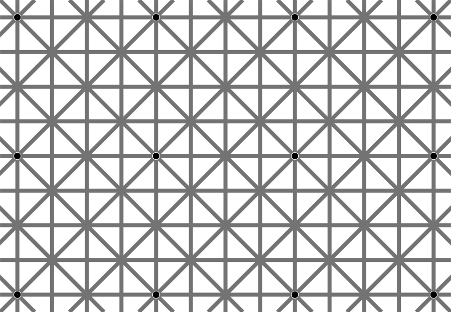
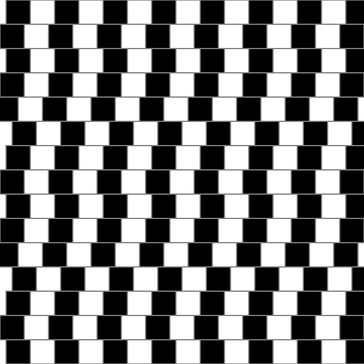
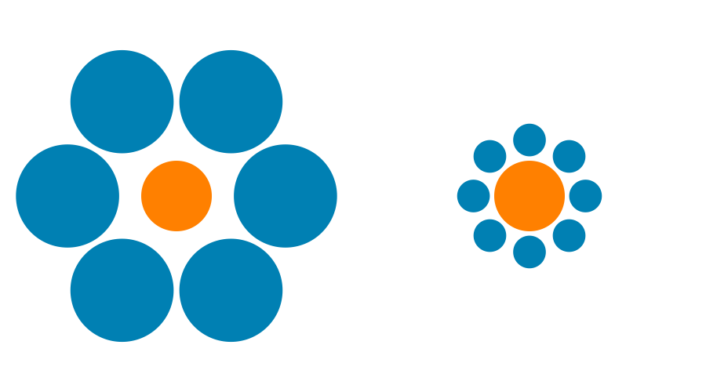
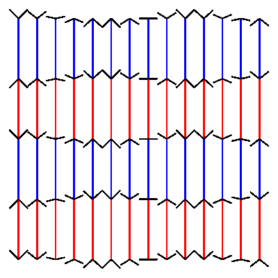
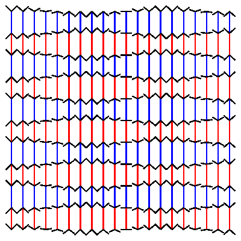
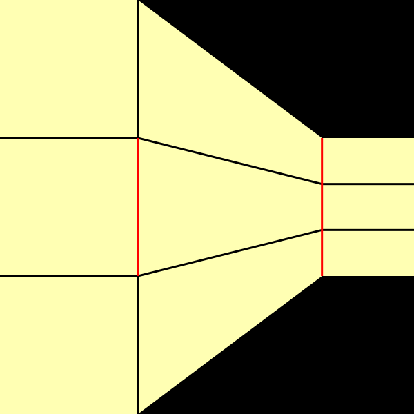
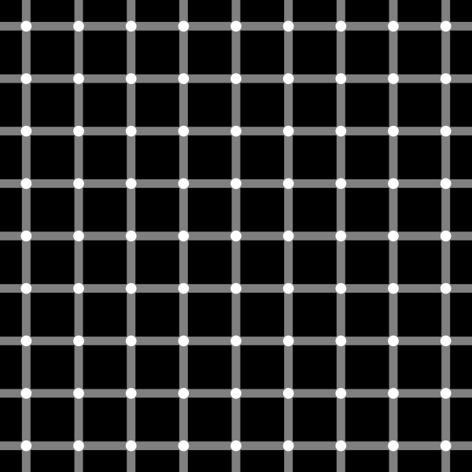
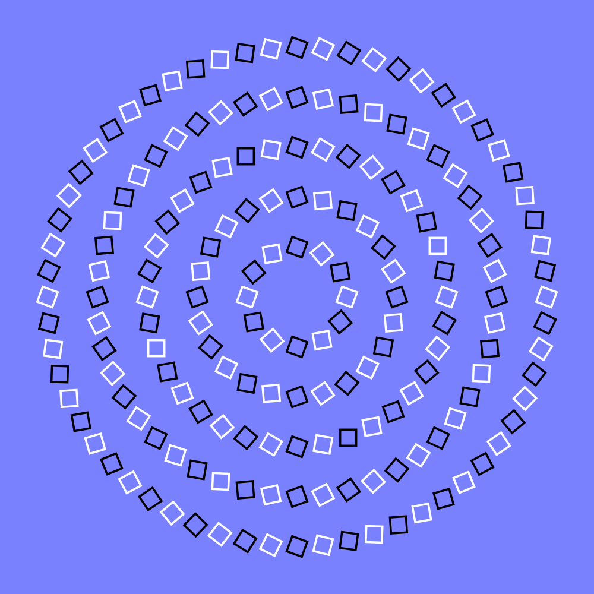
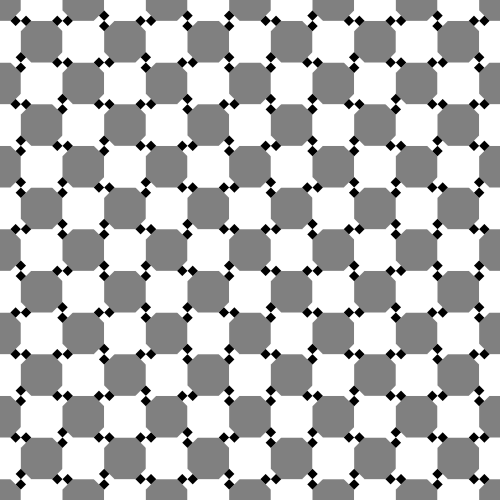
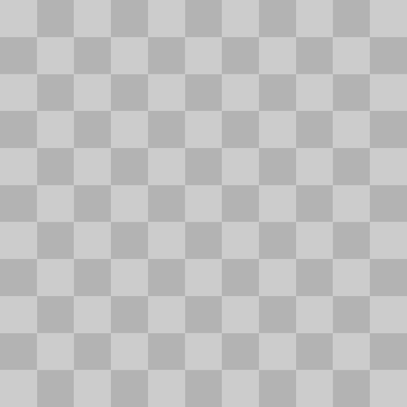

# Optical Illusions  

A set of script to draw some classic optical illusions.

## 12dot_grid.py
  

## Cafe_wall_illusion.py
  

## Ebbinghaus_illusion.py
  

## Mueller_Lyer_Illusion.py
  
  

## Ponzo_illusion.py
  

## grid_illusion.py
  

## rotated_squares.py
  

## rotating_checkerboard.py
  

## wavy_checkerboard.py
  

## wundt_illusion.py  
  