# Vera Molnar

A bunch of scripts that generate images simlar to artworks by the early computer artist Vera Molnar.   
The images are sometimes inspired by her art works and sometimes try to re-code an original as close as possible.
See this nice [interview with Vera Molnar](https://vimeo.com/273642211) on vimeo.

## dots_size_vs_darkness.py
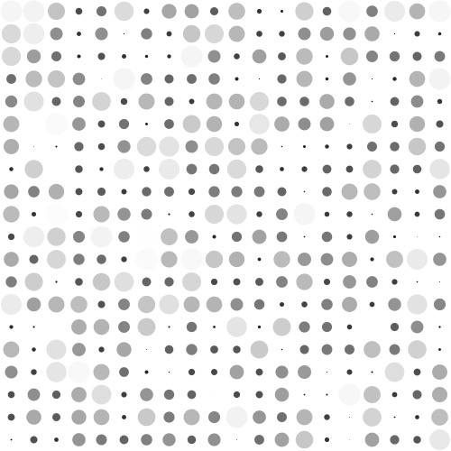  

## lines_rotating.py
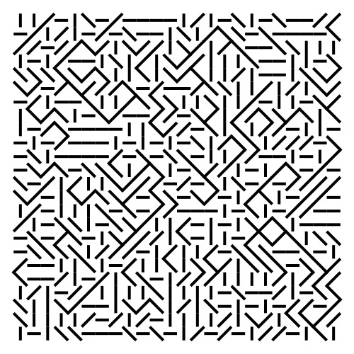  

## random_grids.py
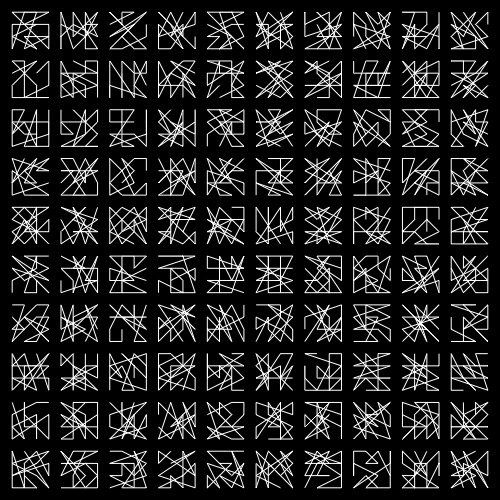  

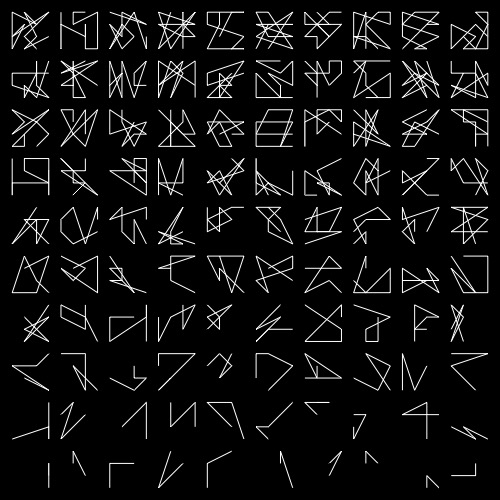  

## random_lines_rotation.py
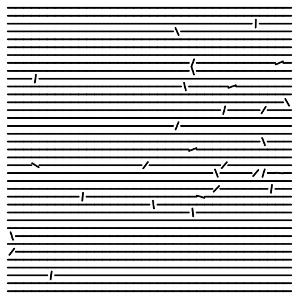  

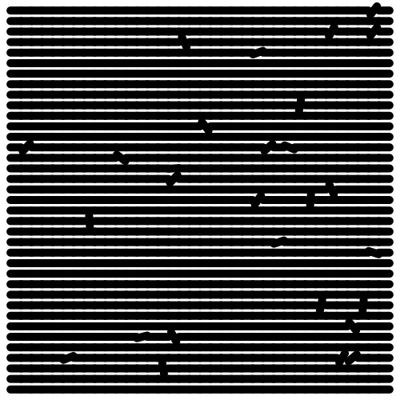  

## random_lozenge.py
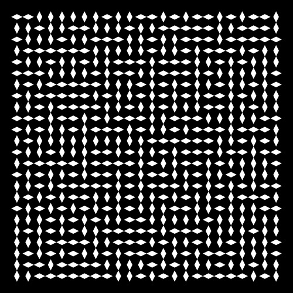  

## random_squares.py
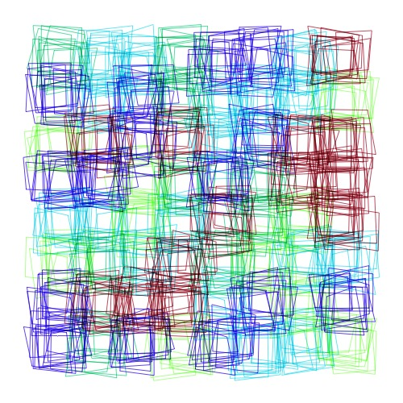  

## rotating_H.py
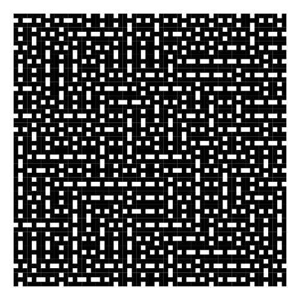  

## rotating_I.py
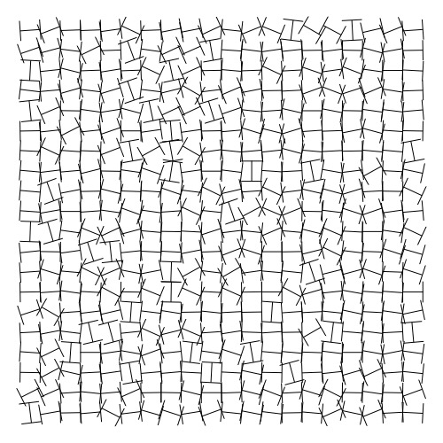  

## rotating_M.py
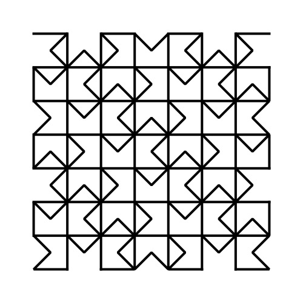  

## rotating_Y.py
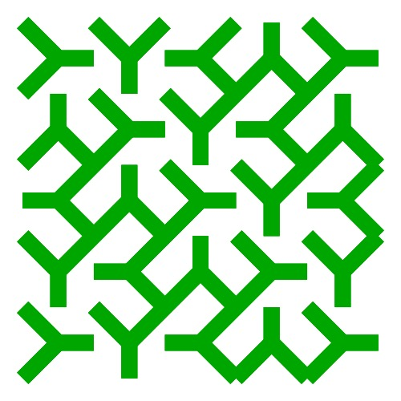  

## rotating_lineCells.py
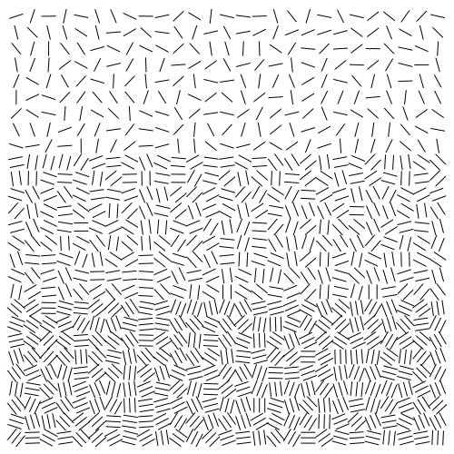  

## rotating_rect_sameGrid.py
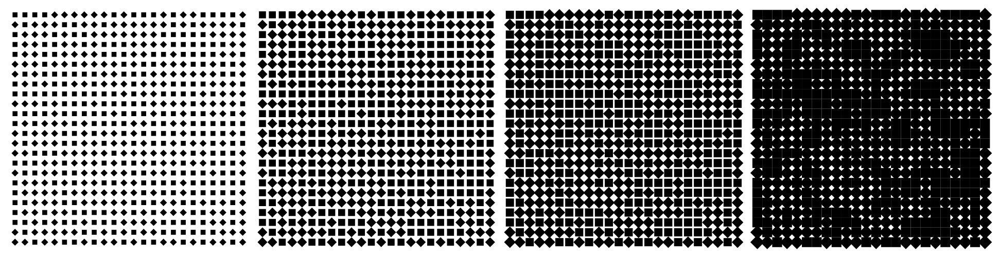  

## rotating_square.py
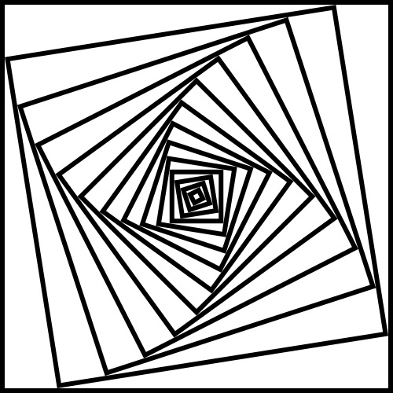

  

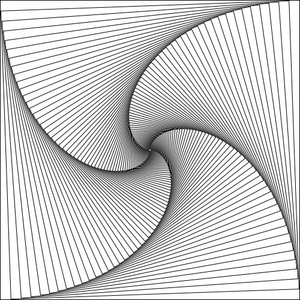  

## spiral.py
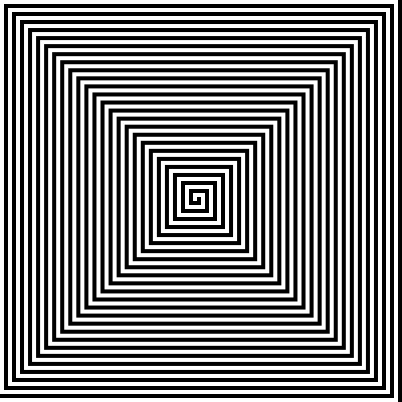  

## square-pattern.py
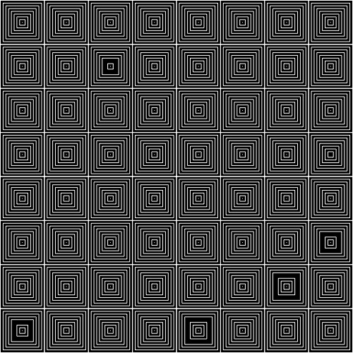  
